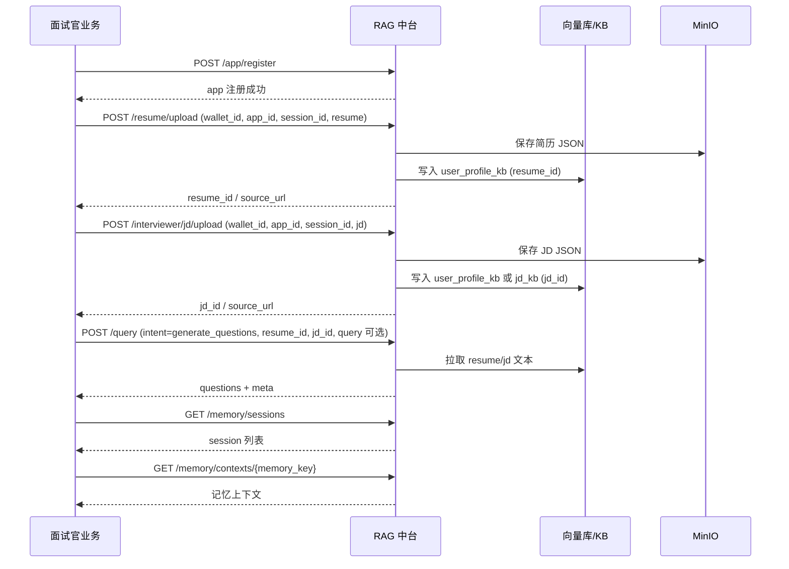

# Interviewer 插件与 RAG 中台交互文档（含作业摄取）

> 适用对象：面试官业务（`app_id=interviewer`）  
> 本文基于插件代码（`pipeline.py` / `intents.yaml` / `config.yaml`）整理  
> 重点覆盖：**intent 规范**、**参数选择**、**简历/JD 数据进入**、**作业摄取**、**查询**  

---

## 1. 身份与权限

**身份字段**
- `wallet_id`：开发者/管理员身份（所有接口必带）
- `app_id`：业务插件 ID（`interviewer`）
- `session_id`：业务会话 ID（用于私有库隔离）
- `private_db_id`：私有库 ID（用于跨会话聚合）
- `data_wallet_id`：业务用户钱包（仅 user_upload KB 用于路径隔离）

**权限规则**
- 只有 `owner` 或 `super_admin` 可以注册/管理 app
- `owner` 记录在 `app_registry.owner_wallet_id`
- `super_admin` 由配置 `SUPER_ADMIN_WALLET_ID` 指定

---

## 2. 插件 KB 与数据来源

`config.yaml` 定义：
- `jd_kb`：`static_kb`（对全局共享）
- `user_profile_kb`：`user_upload`（按私有库隔离）
- prompt aliases：
  - `jd_text -> jd_kb`
  - `resume_text -> user_profile_kb`

结论：
- **JD 可写入 `jd_kb` 或 `user_profile_kb`**
- **简历默认写入 `user_profile_kb`**
- user_upload KB 必须传 `session_id` 或 `private_db_id`

**JD 自动检索开关**
- `prompt.jd_retrieval.enabled`：是否启用“仅简历时自动检索 JD”
- `prompt.jd_retrieval.top_k`：检索条数
- `prompt.jd_retrieval.min_score`：最低相关度阈值（0~1）

---

## 3. Intent 规范（基于插件代码重写）

### 3.1 对外可用 intent（exposed）
**只有一个：`generate_questions`**

用途：  
基于 JD + 简历 + 上下文生成三类面试题（基础 / 项目 / 场景）

### 3.2 内部 intent（不可直接调用）
- `basic_questions`
- `project_questions`
- `scenario_questions`

这些 intent 由 `pipeline.py` 内部串联调用，外部直接调用会被拒绝。

### 3.3 `generate_questions` 的参数规范
`intent_params` 建议字段（插件会读取）：

| 字段 | 类型 | 默认 | 说明 |
|------|------|------|------|
| basic_count | int | 3 | 基础题数量 |
| project_count | int | 3 | 项目题数量 |
| scenario_count | int | 3 | 场景题数量 |
| target_position | str | "" | 目标岗位 |
| company | str | "" | 公司名 |
| resume_text | str | "" | 直接传简历文本（可选） |
| jd_text | str | "" | 直接传 JD 文本（可选） |

**优先级（插件内部逻辑）**
1) 如果传 `resume_text/jd_text` → 直接使用  
2) 如果传 `resume_id/jd_id`（由 /query 自动注入并从 KB 找回）  
3) 若简历/JD 仍为空 → 使用 `query` / 默认提示语兜底  

**说明**
- `resume_url/jd_url` 已移除，不再从 MinIO URL 读取文本  

**补充：仅简历时 JD 自动检索**
- 当 `jd_id/jd_text` 均缺失时  
  中台会用 `resume_text` 去 `jd_kb` 做向量检索  
  并把 Top-K 结果拼接写入 `intent_params.jd_text`  
  以保证 pipeline 直接可用 JD 上下文

**query 字段使用规则（当前交互逻辑）**
- 若已提供 `resume_id` 或 `resume_text`（或自动回填的 `resume_text`）：
  - `query` **可省略**
  - pipeline 会优先使用简历文本作为 user_query
- 若已提供 `jd_id` / `jd_text` 且无简历：
  - `query` 也可省略，pipeline 使用 JD 文本兜底
- 若简历/JD 都没有：
  - `query` **必须提供**，否则 /query 返回 400
  - 可选传 `target` / `company` 参与默认问题构造

**参数场景说明（建议用法）**
- 只有简历：
  - 推荐传 `resume_id`（来自 `/resume/upload`）
  - 或直接传 `intent_params.resume_text`
  - 未传 `jd_id` 时可能触发 JD 自动检索（见上文）
- 简历 + JD：
  - 推荐传 `resume_id` + `jd_id`
  - 或直接传 `intent_params.resume_text/jd_text`
- 简历/JD 都没有：
  - 必须传 `query`（可选 `target/company`）

**字段来源说明**
- `resume_id`：`/resume/upload` 返回
- `jd_id`：`/{app_id}/jd/upload` 返回
- `intent_params.resume_text/jd_text`：业务侧直接拼好文本传入

**限制**
- `basic_count / project_count / scenario_count` 不能为负数  
- `intent` 必须是 `generate_questions`  

---

## 4. 业务注册与状态确认

### 4.1 注册 app
`POST /app/register`

```json
{
  "wallet_id": "super_admin",
  "app_id": "interviewer"
}
```

### 4.2 查看 app 状态
`GET /app/interviewer/status?wallet_id=super_admin`

确认：
- app 是否 active
- plugin 是否可用
- KB 是否可访问

---

## 5. 会话与私有库绑定规则

业务侧生成 `session_id`，后续请求携带：

- 对 user_upload KB：  
  **session_id 必填**（或传 private_db_id）
- `session_id` 与 `private_db_id` 同时传入必须一致，否则 400

可选显式管理：
- `POST /private_dbs`
- `POST /private_dbs/{private_db_id}/bind`
- `GET /private_dbs/{private_db_id}/sessions`

---

## 6. 简历 / JD 上传（业务侧 JSON）

### 6.1 简历上传
`POST /resume/upload`

```json
{
  "wallet_id": "super_admin",
  "app_id": "interviewer",
  "session_id": "session_001",
  "resume": {
    "name": "Alex",
    "skills": ["python", "golang"],
    "text": "Backend engineer with 5 years of experience."
  }
}
```

返回：
```json
{
  "resume_id": "...",
  "doc_id": "...",
  "source_url": "minio://..."
}
```

### 6.2 JD 上传
`POST /interviewer/jd/upload`

```json
{
  "wallet_id": "super_admin",
  "app_id": "interviewer",
  "session_id": "session_001",
  "jd": {
    "title": "Backend Engineer",
    "requirements": ["Python", "Distributed Systems"],
    "text": "We are looking for..."
  }
}
```

---

## 7. 作业摄取（文件上传 + 入库）

### 7.1 上传真实文件到 MinIO
`POST /ingestion/upload`（`multipart/form-data`）

表单字段：
- `wallet_id` / `app_id` / `kb_key` 必填  
- `data_wallet_id` 可选（user_upload 用于隔离）  
- `file` 必填  

响应：
```json
{
  "source_url": "minio://bucket/...",
  "file_type": "json",
  "content_sha256": "...",
  "size_bytes": 2048
}
```

### 7.2 用 MinIO URL 创建摄取作业
`POST /ingestion/jobs?run=true`

```json
{
  "wallet_id": "super_admin",
  "app_id": "interviewer",
  "kb_key": "user_profile_kb",
  "session_id": "session_001",
  "source_url": "minio://bucket/xxx.json",
  "file_type": "json"
}
```

说明：
- `user_upload` 类型要求 `session_id` / `private_db_id`
- 可选传 `data_wallet_id` 做路径隔离

---

## 8. 查询（核心调用）

`POST /query`

```json
{
  "wallet_id": "super_admin",
  "app_id": "interviewer",
  "session_id": "session_001",
  "intent": "generate_questions",
  "resume_id": "resume_xxx",
  "jd_id": "jd_xxx",
  "target": "后端工程师",
  "company": "某科技公司",
  "intent_params": {
    "basic_count": 3,
    "project_count": 3,
    "scenario_count": 3,
    "target_position": "后端工程师",
    "company": "某科技公司"
  }
}
```

**说明**
- `intent` 必填且只能是 `generate_questions`
- `resume_id/jd_id` 会在中台自动回填 `resume_text/jd_text`
- `intent_params` 可为空，但建议提供
- `query` 在已有简历/JD 时可省略
- `target/company` 会透传为 `intent_params.target_position/company`

---

## 9. 记忆查看（后台）

### 9.1 会话列表
`GET /memory/sessions?wallet_id=super_admin&app_id=interviewer`

### 9.2 会话详情
`GET /memory/contexts/{memory_key}?wallet_id=super_admin`

---

## 10. 常见错误与排查

| 错误 | 原因 | 解决 |
|------|------|------|
| 400 intent not exposed | intent 非对外 | 使用 `generate_questions` |
| 422 missing intent | /query 未传 intent | 补充 intent |
| 400 query or intent_params required | 简历/JD均缺失且未提供 query | 传 query 或简历/JD |
| 400 session/private_db mismatch | 二者不一致 | 保证绑定一致 |
| 403 wallet_id not owner | 权限不足 | 使用 owner 或 super_admin |

---

## 11. 推荐最小调用链

1. `POST /app/register`
2. `POST /resume/upload`
3. `POST /interviewer/jd/upload`
4. `POST /query`
5. （可选）记忆查看

---

## 12. 时序图（业务 ↔ 中台）



---

## 13. 接口参数表（必填 / 可选 / 说明）

### 13.1 `POST /app/register`

| 字段 | 必填 | 类型 | 说明 |
|------|------|------|------|
| wallet_id | ✅ | string | 开发者钱包 |
| app_id | ✅ | string | 业务插件 ID（interviewer） |

---

### 13.2 `GET /app/{app_id}/status`

| 参数 | 必填 | 类型 | 说明 |
|------|------|------|------|
| wallet_id | ✅ | string | 开发者钱包 |
| app_id | ✅ | string | 路径参数 |

---

### 13.3 `POST /resume/upload`

| 字段 | 必填 | 类型 | 说明 |
|------|------|------|------|
| wallet_id | ✅ | string | 开发者钱包 |
| app_id | ✅ | string | interviewer |
| session_id | ✅ | string | 业务会话 |
| private_db_id | ❌ | string | 可选（与 session_id 一致） |
| resume_id | ❌ | string | 可选自定义 |
| resume | ✅ | object / string | 简历内容 |
| metadata | ❌ | object | 业务扩展字段 |

---

### 13.4 `POST /{app_id}/jd/upload`

| 字段 | 必填 | 类型 | 说明 |
|------|------|------|------|
| wallet_id | ✅ | string | 开发者钱包 |
| app_id | ✅ | string | interviewer |
| session_id | ✅ | string | 业务会话 |
| private_db_id | ❌ | string | 可选（与 session_id 一致） |
| jd_id | ❌ | string | 可选自定义 |
| jd | ✅ | object / string | JD 内容 |
| metadata | ❌ | object | 业务扩展字段 |

---

### 13.5 `POST /ingestion/upload`（multipart）

| 字段 | 必填 | 类型 | 说明 |
|------|------|------|------|
| wallet_id | ✅ | string | 开发者钱包 |
| app_id | ✅ | string | interviewer |
| kb_key | ✅ | string | 目标 KB |
| data_wallet_id | ❌ | string | 仅 user_upload |
| filename | ❌ | string | 可选覆盖文件名 |
| file | ✅ | file | 要上传的文件 |

---

### 13.6 `POST /ingestion/jobs`

| 字段 | 必填 | 类型 | 说明 |
|------|------|------|------|
| wallet_id | ✅ | string | 开发者钱包 |
| app_id | ✅ | string | interviewer |
| kb_key | ✅ | string | 目标 KB |
| session_id | 条件 | string | user_upload 必填 |
| private_db_id | 条件 | string | user_upload 可选 |
| data_wallet_id | ❌ | string | user_upload 可选 |
| source_url | ✅ | string | minio:// |
| file_type | ❌ | string | 可选 |
| metadata | ❌ | object | 业务扩展 |
| options | ❌ | object | 解析参数 |

---

### 13.7 `POST /query`

| 字段 | 必填 | 类型 | 说明 |
|------|------|------|------|
| wallet_id | ✅ | string | 开发者钱包 |
| app_id | ✅ | string | interviewer |
| session_id | ✅ | string | 业务会话 |
| intent | ✅ | string | 仅 generate_questions |
| resume_id | ❌ | string | 推荐 |
| jd_id | ❌ | string | 推荐 |
| target | ❌ | string | 目标岗位（会透传 intent_params.target_position） |
| company | ❌ | string | 公司名（会透传 intent_params.company） |
| query | 条件 | string | 当简历/JD 都缺失时必填 |
| intent_params | ❌ | object | 参数集 |

---

### 13.8 `GET /memory/sessions`

| 参数 | 必填 | 类型 | 说明 |
|------|------|------|------|
| wallet_id | ✅ | string | 开发者钱包 |
| app_id | ✅ | string | interviewer |

---

### 13.9 `GET /memory/contexts/{memory_key}`

| 参数 | 必填 | 类型 | 说明 |
|------|------|------|------|
| wallet_id | ✅ | string | 开发者钱包 |
| memory_key | ✅ | string | 记忆会话键 |

---

## 14. 异常场景与修复建议

| 场景 | 报错 | 原因 | 修复 |
|------|------|------|------|
| 非 owner 调用注册 | 403 | 权限不足 | 使用 owner 或 super_admin |
| session/private_db 不一致 | 400 | 绑定冲突 | 保证一致后重试 |
| /query 缺 intent | 422 | intent 必填 | 传 generate_questions |
| /query 无简历/JD且无 query | 400 | query 或 intent_params 为空 | 传 query 或简历/JD |
| ingestion upload 失败 | 400 | MinIO 未启用 | 检查 MinIO 配置 |
